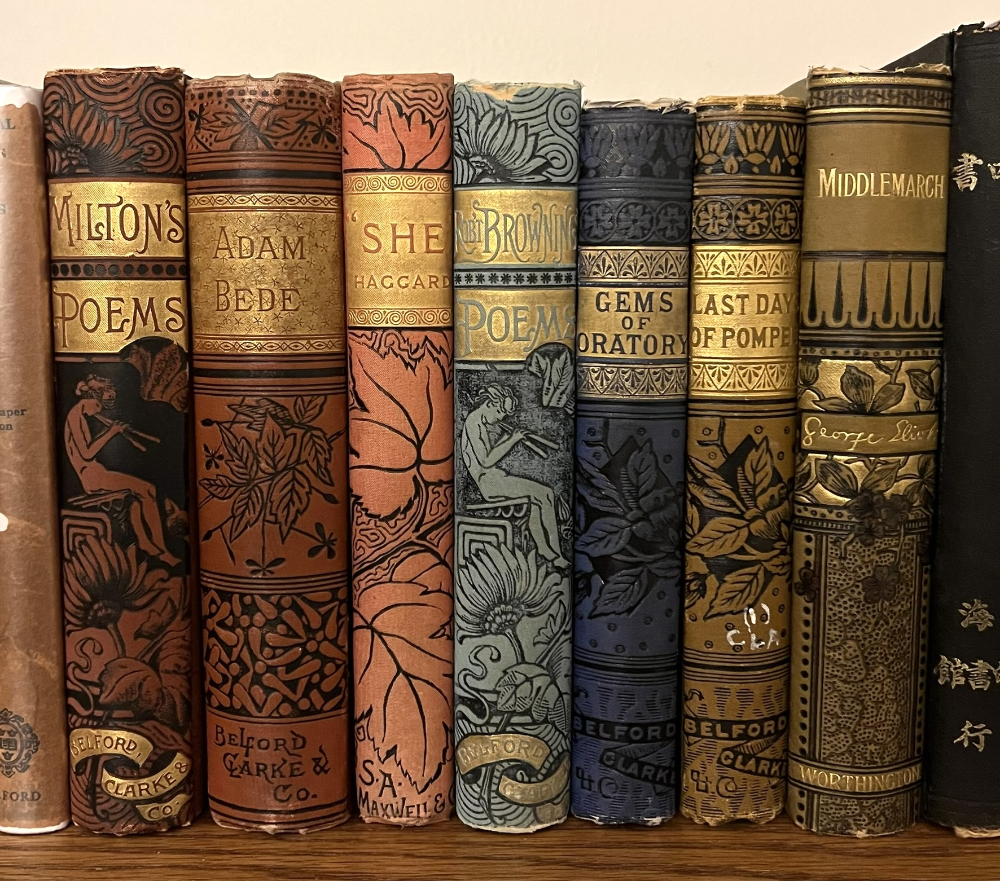
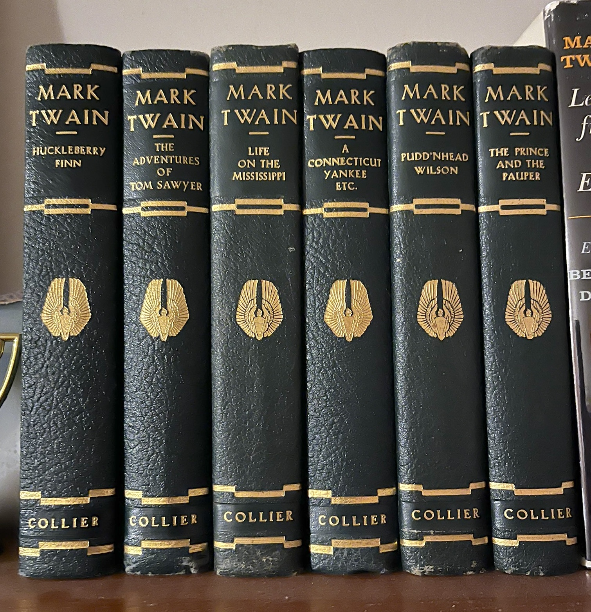

#### [Home](index.md) | [Physics](physics.md) | [Film](film.md) | [Game of Go](go.md) | [Misc](misc.md)

# Books

> "I cannot remember the books I've read any more than the meals I have eaten; even so, they have made me." - Ralph Waldo Emerson

---

### Book Collecting

I started collecting books as a hobby a few years ago, with a focus on classic 20th century literature, science, and science fiction. I love the look and feel of vintage hardcover books; they were made to last a lifetime, and the artwork and design are just gorgeous. In the world of bookbinding, the aphorism "they just don't make 'em like they used to" very much applies. In my view, the 1960's and 70's was the time of the most beautiful books: cloth-bound hardcovers with their original dust jackets, whose artwork is often quintessentially of its time. Victorian era bindings are also beautiful, with gold-leaf accents on the spines and embossed print on the covers.

As my collection grew, I opened a store for vintage books on eBay, [Yellowjacket Books](https://www.ebay.com/usr/yellowjacketbooks). I like to browse used bookstores and especially [library book sales](https://booksalefinder.com), where you can often find hidden treasures for just a few dollars. 

  
&nbsp; &nbsp; &nbsp;
  

For some cool book lists, check out [thegreatestbooks.org](https://thegreatestbooks.org). This site has compiled lists of the all-time greatest works of fiction and non-fiction, ranked via a weighted average of dozens of best-of lists from across the web.

|  | 
|:--:| 
| *Vintage physics textbooks. The series in green jackets is the famous Landau and Lifshitz "Course of Theoretical Physics", a legendary series written by two Soviet scientists known for its remarkable logical clarity. Sometimes I think that if civilization were destroyed, these are the books I would preserve.* |

