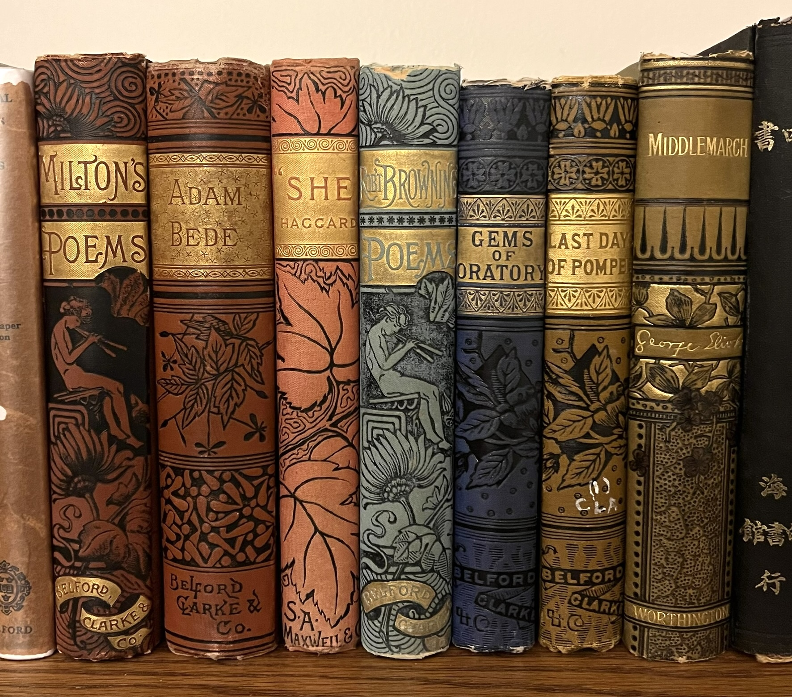
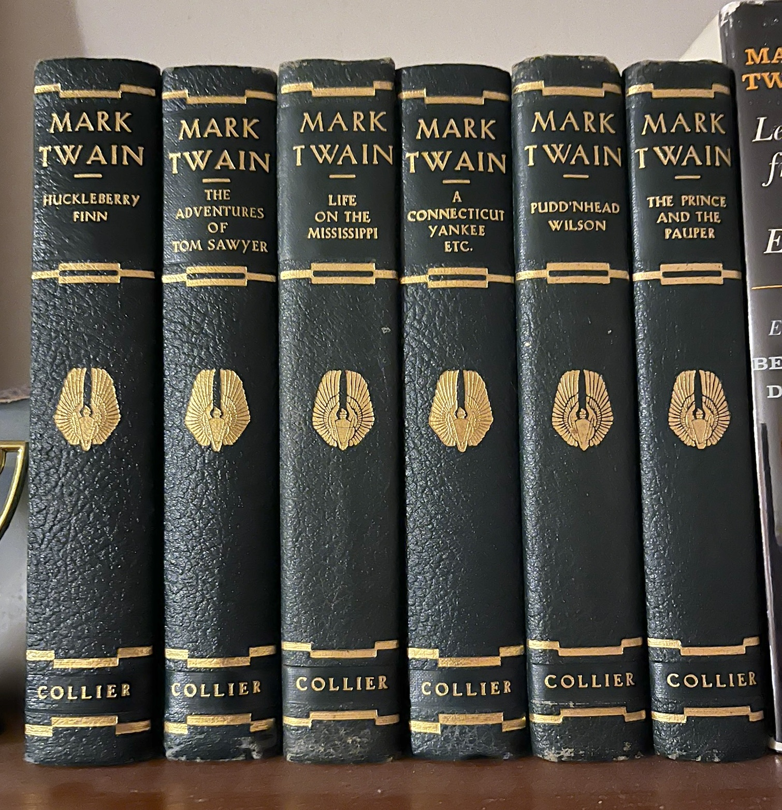

#### [Home](index.md) | [Physics](physics.md) | [Film](film.md) | [Game of Go](go.md) | [Misc](misc.md)

# Books

---

> "I cannot remember the books I've read any more than the meals I have eaten; even so, they have made me." - Ralph Waldo Emerson

### Book Collecting

A few years ago I started collecting books as a hobby, with a focus on classic 20th-century literature, science, and science fiction. I love the look and feel of vintage hardcover books; they were made to last a lifetime, and the artwork and design are just gorgeous. In the world of bookbinding, the aphorism "they just don't make 'em like they used to" very much applies. In my view, the 1960's and 70's was the era of the most beautiful books: cloth-bound hardcovers with their original dust jackets, whose artwork is often quintessentially of its time. Victorian era bindings are also beautiful, with gold-leaf accents on the spines and embossed print on the covers.

I like to visit used bookstores and especially [library book sales](https://booksalefinder.com), where you can often find hidden treasures for just a few dollars. As my collection grew, I opened a store on eBay, [Yellow Jacket Books](https://www.ebay.com/usr/yellowjacketbooks). We've done a few in-person festivals and fairs as well. 

|  |
|:--:| 
| *Our booth at the 2026 Tucson Festival of Books* |

<!---

  
&nbsp; &nbsp; &nbsp;
  

-->

<!---
|  |
|:--:| 
| *left: Antique bindings from Belford & Clarke, circa 1880's.   right: Modern paperbacks by Haruki Murakami* |
-->

Check out [thegreatestbooks.org](https://thegreatestbooks.org) for some nice lists of the all-time greatest works of fiction and non-fiction, ranked via a weighted average of dozens of best-of lists from across the web.

|  | 
|:--:| 
| *Vintage physics textbooks. The set with green jackets is the legendary "Course of Theoretical Physics" by Landau & Lifshitz, two Soviet scientists, known for its remarkable logical clarity.* |

